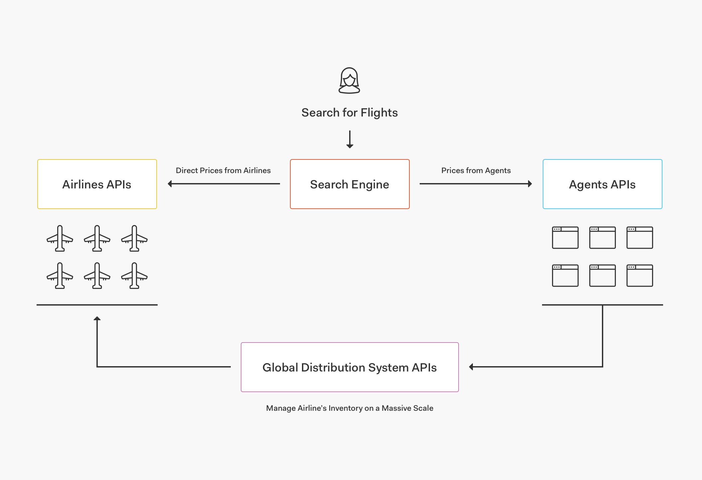

Travel is one of the world's fastest-growing sectors with demand reaching an all-time high, according to [Deloitte's 2018 Travel and Hospitality Industry Outlook](https://www2.deloitte.com/content/dam/Deloitte/us/Documents/consumer-business/us-cb-2018-travel-hospitality-industry-outlook.pdf). 

Directly or indirectly, economic contributions in [travel and tourism now account for 10.4% of global GDP](https://www.wttc.org/-/media/files/reports/economic-impact-research/regions-2018/world2018.pdf), reports the World Travel & Tourism Council. Travel investment is set to reach $925B in 2018, and rise by an average of 4.3% over the next ten years to $1,408.3B by 2028.

According to a report by the [World Economic Forum](https://www.weforum.org/) from January 2017, there is widespread recognition among industry leaders that the role of technology is changing from being a driver of marginal efficiency to an enabler of fundamental innovation and disruption. The report states "Digitalization represents an exciting opportunity for the aviation, travel and tourism ecosystem, with the potential to unlock approximately $1 trillion of value for the industry and wider society over the next decade."

In this rapidly growing market, digital transformation is key to staying agile. Application Programming Interfaces (APIs) play a large role in digital transformation and are key tools that allow travel businesses to provide value to customers and, ultimately, compete better. From hotels and flights to cars and buses, [there is an API for virtually every area of travel](https://www.programmableweb.com/news/top-10-travel-apis-uber-tripadvisor-and-expedia/analysis/2015/04/24).

Even mega-giants like [Amadeus](https://amadeus.com/en), [Sabre](https://www.sabretravelnetwork.com/home/), and [Travelport](https://www.travelport.com/), who are the dominant players in the area of one-stop shop travel solutions, have their own [APIs for comprehensive booking and reservations services](https://www.altexsoft.com/blog/engineering/travel-and-booking-apis-for-online-travel-and-tourism-service-providers/). But they didn't start with APIs — they've been dominating this sector for much longer than APIs have been popular.

> In the fiercely contested travel industry, digital transformation is key to staying agile. Auth0 streamlines API development."

## Digital Transformation in the Travel Industry Started in the 1950s

With the boom of general aviation in the 1950s, the travel industry was forced to scale quickly. Digital tools were developed to automate how airlines track and sell their inventory. This was the first digital transformation in travel, even before the beginning of the internet. From there, Sabre — or Semi Automated Business Research Environment — was born. The first global distribution system (GDS), Sabre was started in the 1960s with a collaborative effort by American Airlines and IBM. Travelport was developed by United Airlines in the 1970s and Amadeus soon followed, developed by a group of European airlines in the 1980s.

These [three major players still make up more than 90% of the global market](http://www.businesstravel-iq.com/article/2018/08/08/gds-market-share-second-quarter-2018) in airline bookings — and their dominance is down to digital transformation. This gave them the ability to streamline business processes and reach into more areas of the travel industry with relatively little friction.

## The Plumbing of the B2B Travel Industry

Suppliers like hotel companies and airlines need to connect with distributors such as wholesalers and GDSs to reach as large an audience as possible for their products. In this scenario, without an API, the suppliers must upload their inventory to the GDS and similar companies that help connect partners and products to consumers, incurring a cost associated with the distribution. This increases ticket prices.

However, if a supplier has an API, it is easier for them to connect supply and demand directly, meaning less cost is passed on to the consumer. By building their own APIs, suppliers like the fictional "airline.com" are almost becoming direct-to-consumer distributors of their own products, offering their own sites or apps to book on, and possibly marketing through a metasearch engine.

Additionally, with APIs, "airline.com" can also sell ancillaries such as rental cars or even hotel rooms through the APIs offered by those ancillary services.

This means that suppliers have built APIs that help them sell more directly, market through metasearch, and integrate with a rental car or a hotel room providers' APIs as well to bolster their package or complementary travel offering.

As Sonja Woodman explained in [APIs – The Plumbing of the B2B Travel Industry](http://www.triometric.net/travel-analytics/apis-the-plumbing-of-the-b2b-travel-industry/), "The whole industry is underpinned by a complex layer of networks and APIs — the plumbing of the B2B travel industry — e.g. communication links and API connectors between merchandising platforms, central reservation systems, global distribution systems, industry transaction hubs and gateways, etc."

## Metasearch Simplifies the Consumer Search Process

Metasearch engines like [Skyscanner](https://www.skyscanner.com/) and [Trivago](https://www.trivago.com/) take data from airlines, travel agents, and global distribution systems and aggregate the results. By aggregating this data, they can provide a website and app that greatly improves customers' experience in finding the cheapest rates for flights (now including hotels and vehicles) and then linking the customer directly to the retailer to make their booking.

Metasearch engines ultimately aggregate prices and show the best options. Potentially, a simple search for flights could run through hundreds of sources of data all linked in a web of APIs, pulling data from different sources.

## TripAdvisor Encourages Partners to Develop APIs

Online Travel Agents (OTAs) like [TripAdvisor](https://www.tripadvisor.com/), [Hotels.com](https://www.hotels.com/) and [Booking.com](https://www.booking.com/) offer hotel rooms, flight tickets, holiday packages, train tickets, and other tourism products directly to consumers by charging a commission.

The power of traditional OTAs usually comes from partners prepared to regularly upload their inventory. The partner bears the overhead of conforming with APIs and developing software to mass upload inventory. The effort of integrating with an API typically does not go the other way around. In other words, TripAdvisor would not spend time integrating with a retailer or hotel chain's APIs unless they were pretty big — think Hilton, Westin, or Four Seasons.

TripAdvisor's service, the TripAdvisor Self Implemented Partner program, is ready to integrate with any partner APIs, so long as those APIs have been built to TripAdvisor's specifications.

TripAdvisor and suppliers get the benefit of valuable live pricing by allowing TripAdvisor to pull prices on demand. This takes place in lieu of having to rely on daily uploads of inventory. With traditional inventory uploads, there is a risk that rooms can become unavailable between the upload and the customer trying to make a booking. In this new API-driven model, consumers gain access to great rates that don't disappear once they try to book them.

> "New APIs have the inevitable overhead of developing security, and dedicating resources to it has a cost. Secure your API with Auth0."

## Secure Your APIs with Auth0

Creating new APIs has the inevitable overhead of developing security. At a basic level, secure and authorized API integration is required for partners to communicate securely, to identify partner functionality and features, and to apply pricing and billing mechanisms. Dedicating engineering resources to areas such as authentication, identity, security, and compliance comes at a high opportunity cost but it can also represent a larger risk than relying on experts for the same.

In addition to supplying an identity and access management solution, Auth0 provides the necessary building blocks to secure your APIs much more quickly. We allow companies to focus on the core value-add capabilities of their product versus focusing time and effort on implementing capabilities that Auth0 provides out of the box.

Think of the tens, hundreds, or even thousands of API calls that could be triggered behind the scenes by a search for flights. Each one of those calls is made across the internet and secured each time by a layer of security and access management. Building this type of access management is time consuming, and can be substantially challenging to secure.

[APIs are helping to drive digital transformation right now](https://deloitte.wsj.com/cio/2016/06/27/apis-help-drive-digital-transformation/), with digitalization no longer a case of 'if' but 'when.' According to [MuleSoft's Connectivity Benchmark Report 2018](https://www.mulesoft.com/lp/reports/connectivity-benchmark), nearly three quarters of IT decision makers are currently carrying out digital transformation initiatives and nearly 60% claimed that APIs had increased productivity in business operations.

Add Auth0 to this API-centric shift in digital culture and benefit from faster development and more security than if you were to build it yourself. Auth0 provides a polished and reliable service, with tools that are easy to use and implement. In fact, enabling powerful features can be as easy as flipping a switch and hundreds of valuable development hours can go back to writing business logic. [Security is strengthened](https://auth0.com/security), with Auth0 shouldering the responsibility of adhering to security compliance policies and certifications. This means that lots of time dedicated to testing and security can be returned to core app work. Use Auth0 to secure your APIs to maintain your upward trajectory in the digitalization of the travel industry.

## About Auth0

Auth0, the identity platform for application builders, provides thousands of enterprise customers with a Universal Identity Platform for their web, mobile, IoT, and internal applications. Its extensible platform seamlessly authenticates and secures more than 2.5B logins per month, making it loved by developers and trusted by global enterprises. The company's U.S. headquarters in Bellevue, WA, and additional offices in Buenos Aires, London, Tokyo, Sydney, and Singapore, support its customers that are located in 70+ countries.

For more information, visit [https://auth0.com](https://auth0.com/) or follow [@auth0 on Twitter](https://twitter.com/auth0).