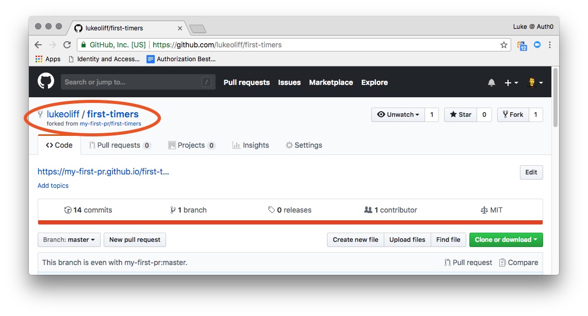
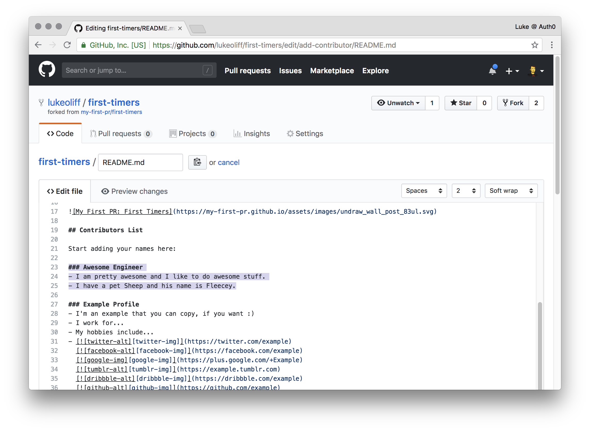
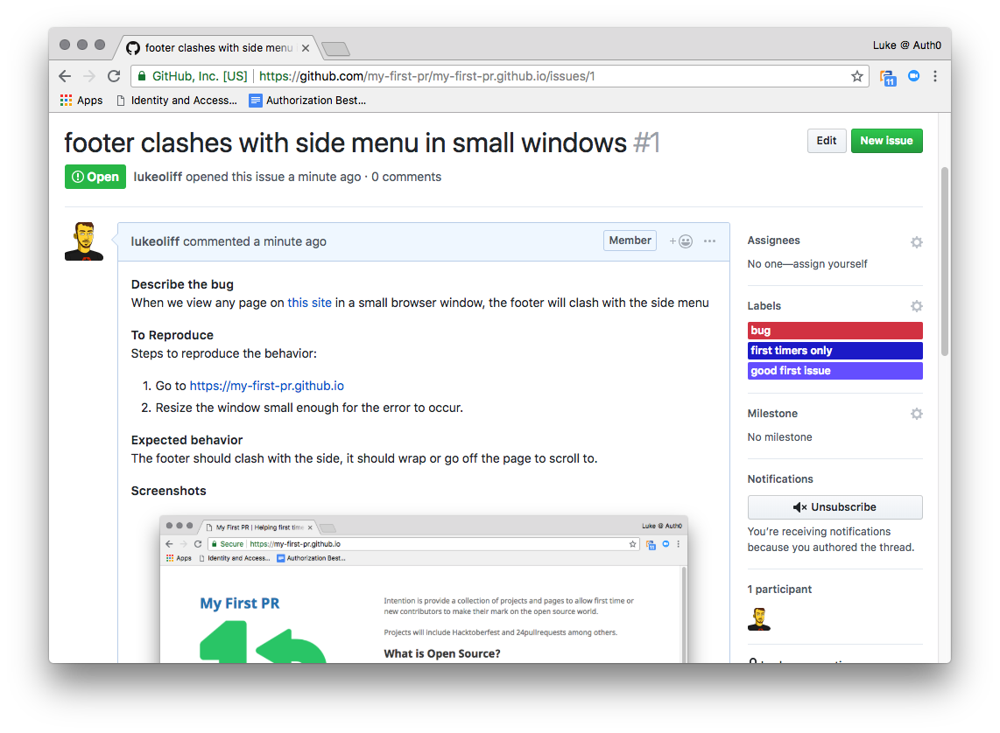

Here at [Auth0, we’re all about open source](https://auth0.com/opensource). As a business, we actively contribute to, and benefit from, open source and have over 25,000 stars across multiple projects. 

[Our community](https://community.auth0.com/) underpins that initiative with direct access to advice and support for developers who might be working on projects, open source or not.

On open source in general, contributions by first-timers and [code newbies](https://www.codenewbie.org/) are encouraged, because that is the essence of open source: Learning and collaboration, together, for the benefit of everyone. It can be scary and a little overwhelming the first time, but there are [projects](https://www.firsttimersonly.com/) and [events like Hacktoberfest](https://auth0.com/blog/celebrate-hacktoberfest-with-auth0/) out there tailored to helping you to get involved and gain confidence in making your first contribution.

## What is Open Source?

Open source is a [movement](https://opensource.org/) that supports collaboration, and a [process](https://en.wikipedia.org/wiki/Open-source_software_development) by which software source is developed in the public domain for use or modification by anyone. Arguably, open source is where true innovation can happen. Nothing gets the creative juices flowing like collaborating with like-minded individuals.

These days, it’s hard to make software without an open source library. When the [left-pad event (I don't like calling it a fiasco) occurred](https://www.theregister.co.uk/2016/03/23/npm_left_pad_chaos/), it highlighted the importance of an open and permissive community and it only works while we’re in it together. It may seem to some “closed-source” type developers that it’s a weakness of open source, but they’re the same developers who’ll use an open source library to build their software.

There are around 1,100 new open source projects and 10,000 new versions of open source projects every day. The rate of growth in open source is phenomenal, with over 22 million developers involved on GitHub alone. It’s a movement that is fast growing because it’s so supportive of people who want to get involved.

## Projects to Help You Get Involved

Whether you’re a developer or not there are a few ways in which you can get involved in open source projects.

### A Fantastic Solution for First Timers

[First Timers Only is a project](https://www.firsttimersonly.com/) that helps highlight bugs, features, and requests that could be tackled by first-timers. Launched by [Kent C. Dodds](https://github.com/kentcdodds) and [Scott Hanselman](https://github.com/shanselman), the idea is to get new developers to make their first contribution. It relies on project owners wanting to get involved, by labeling up some issues with the label first-timers-only. Users can then [search for `first-timers-only` issues](https://github.com/search?utf8=%E2%9C%93&q=label%3Afirst-timers-only&type=Issues&ref=advsearch&l=&l=).

It’s important for project owners to understand what they’re agreeing to. When they label up these issues they’re making a declaration.

> *“I’m willing to hold your hand so you can make your first PR. This issue is rather a bit easier than normal. And anyone who’s already contributed to open source isn’t allowed to touch this one!”*— some willing project owner

First Timers Only is about encouraging developers to overcome the scary first step, by providing them with a welcoming and supportive environment to learn.

### There Are Tons of Projects Up-For-Grabs

[Up-for-grabs](https://up-for-grabs.net/) provides a curated list of tasks, especially for new contributors. Started by [Keith Dahlby](https://github.com/dahlbyk), [Brendan Forster](https://github.com/shiftkey) and [Justin Rusbatch](https://github.com/jrusbatch), it lets people search for projects with issues for new or first-time contributors.

Like First Timers Only, it also wants project owners to commit to mentor first-time contributors who want to get involved. Project owners need to submit their project to the up-for-grabs project list.

### Hacktoberfest Isn’t Just About Free Swag

But, *there is free swag*.

[Hacktoberfest](https://hacktoberfest.digitalocean.com/) started in 2014 and was launched by [DigitalOcean](https://www.digitalocean.com/) in partnership with [GitHub](https://github.com/) (and now [Twilio](https://www.twilio.com/) for 2018). It’s a month-long celebration of open source, with literally tens of thousands of developers from around the world taking part. Each getting involved in open source projects and if they reach the goals set for the event, they get a free t-shirt and stickers!

This year is poised to be the biggest year yet, with the growth of the event being kinda ridiculous. In 2014, it had just 768 contributors. Last year (2017) it had 31,901 contributors making almost a quarter of a million pull-requests (239,164).

You can take part at home, at work (work permitting) or by attending an event. Events are run around the world, with the goal of learning about and taking part in open source collaboration. Many local meetups will be becoming Hacktoberfest events during October.

You can [register now for alerts to when Hacktoberfest starts](https://hacktoberfest.digitalocean.com/) when you’ll need to sign up. Once signed up you’ll see examples of projects you could start with. Some of these projects may even be in combination with First Timers Only or up-for-grabs, so if you’re new to making contributions you may find a project that is happy to help you get involved while working towards your Hacktoberfest goal.

> "Open source is the past, present, and future. Pay it forward, and let future generations benefit the generosity of you and those before you."

## Dive Right in and Make That Contribution

### Forking

A fork is a copy of someone else’s repository. Forking allows you to freely change the code without affecting the original project. Once you’ve changed the code, you can request the original project’s owner pull in your changes (a pull request), but we’ll get onto those later.

Head to the project I’ve thrown together for this very purpose, [my-first-pull-request/first-timers](https://github.com/my-first-pr/first-timers).

> "Get involved with Open Source today and make your first contributions with My First PR @ https://my-first-pr.github.io"

The intention of this project is to provide a [“safe place” for first timers](https://my-first-pr.github.io/) or new contributors to make their mark on the open source world and to learn how to contribute. On this project, all pull requests will be considered. Whether you’re contributing to the master repository, the event/project repositories, or you’re adding your name to the contributors list. The [My First PR](https://my-first-pr.github.io/) project will guide you through the process of becoming an open source contributor.

Click on Fork to start the process.

Now, GitHub will generate a copy of the repository for you.

Once GitHub has finished, you’ll be able to see your version of first-timers.

### Remote Editing

An often overlooked but powerful capability in GitHub, editing files directly on the repository can allow you to make quick and easy changes or suggestions, and streamline the editing process. The downside is that, if it’s code you’re editing without an IDE, you have no idea if you’re introducing breaking changes.

Before we start editing, create a new branch for your changes.

Once your branch has been created, scroll down to find the `README.md` file.

Open the `README.md` file, which is the markdown file that GitHub chooses to render as the default page for a repository.

You’re going to edit it, to put your name on the list of contributors. So click on Edit to be able to make your changes.

Copy the boilerplate that has been included to use it to write your own entry, or write it from scratch.

The boilerplate shows you markdown text. This is turned by GitHub (and other software) into layout and words, to render it as a website content. This type of content editing is becoming very popular with the rise of [static-site-generators](https://www.staticgen.com/) because it’s a great way to develop content without needing to look at the code it gets turned into. It removes a barrier to entry into content editing.


    ### Example Profile
    - I'm an example that you can copy, if you want :)
    - [![twitter-alt][twitter-img]](https://twitter.com/example)
      [![facebook-alt][facebook-img]](https://facebook.com/example)
      [![google-img][google-img]](https://plus.google.com/+Example)
      [![tumblr-alt][tumblr-img]](https://example.tumblr.com)
      [![dribbble-alt][dribbble-img]](https://dribbble.com/example)
      [![github-alt][github-img]](https://github.com/example)


If you’re interested, there are some [great guides](https://www.markdownguide.org/) and [cheat sheets](https://github.com/adam-p/markdown-here/wiki/Markdown-Cheatsheet) on markdown.

Create your own version, like the example below. It doesn’t need the social links, or images. If it looks too complicated, just leave bits out.

    ### Awesome Engineer
    - I am pretty awesome and I like to do awesome stuff.
    - I have a pet Sheep and his name is Fleecey.
    

Add it to the file with the GitHub editor.

You can now scroll down and commit your code to your copy of this repository. Now, remember we're in our own copy of this project. So we're going to commit directly to the branch we created. Write a commit message and click Commit changes.

### Pull Requests

GitHub is quite helpful when it comes to creating pull requests. Click on the first-timers link to return to the repository root.

Because you recently committed to a branch, GitHub now prompts to create a pull request. Click Compare & pull request.

Fill out the pull request form including any additional comments you might need to leave. Some projects, like this one, provide a template for your pull request, to help you provide all the information they need to review your request efficiently. Once complete, click Create pull request.

You can now review your pull request. Any comments made by a reviewer or the project owner appear here, where you can respond if necessary.

Your changes will get added to a pull-request, for the project owner to approve, leave feedback, or reject.

### Local Editing

You may have an editor that you want to use locally. In which case, you’ll want to clone the repository to your local environment, edit it and push it back to your remote.

First of all, make sure have git installed. Otherwise, [install git](https://git-scm.com/downloads).

Get the clone URL from GitHub for your own fork of the first timers repository. It will be something like https://github.com//first-timers.git

Now open a command line and run the command.

    git clone https://github.com/<your-github-username>/first-timers.git
    

Unless you renamed the repository or changed the destination directory (and if you have no idea what I’m saying, you didn’t), you can change into your new first-timers directory.

    cd first-timers
    

Now create a branch using the git checkout command. The checkout command lets you switch between branches, but the -b argument will create one based on master that doesn’t already exist.

    git checkout -b add-another-contributor
    

The name of the branch does not need to have the word add in it, but it's a reasonable thing to include because the purpose of this branch is to add a name to the list.

Now open the README.md file in an editor, add your name to it. I would place it alphabetically based on the example. Then save the file.

You can check the status of your file changes with git.

    git status
    

Stage your changes, by telling the branch you just made them by using the git add command.

    git add README.md
    

Now commit those changes using the git commit command.

    git commit -m "add an incredible engineer"
    

Push your changes using the command git push. Push sends your changes to GitHub, but if your branch doesn’t track a remote branch on GitHub it will send you errors. For this we tell it to push to origin (GitHub) and -u HEAD will set the upstream to a new remote branch of the same name.

    git push origin -u HEAD
    

Go to your repository on GitHub. Once again, because you recently committed to a branch, GitHub now prompts to create a pull request. Click Compare & pull request.

Just as before, fill out the pull request form including any additional comments you might need to leave. Once complete, click Create pull request.

You can now review your pull request. Any comments made by a reviewer or the project owner appear here, where you can respond if necessary.

Now the project owner potentially has pull requests ready to review and merge.

## Other Ways to Contribute to Open Source

Writing code and making pull requests isn’t the only way to contribute to open source. There are tons of things a project owner wants to do but just hasn’t had the time to do. You may find that your calling is to [document others open source projects](https://medium.com/capital-one-developers/art-of-open-source-documentation-5b8b3f5b0ab) or to create great API documentation and sandboxes using tools like [Postman](https://www.getpostman.com/).

### Raising Issues and Bug Reports

Issues are critical parts of the open source ecosystem, as are how we raise them. Being able to find issues in projects may not be enough if you can’t effectively communicate that issue, where it is, how you found it, or if/how you can reproduce it.

Any GitHub user can create an issue in a public repository where issues are enabled. You can also [raise issues from specific lines of code](https://help.github.com/articles/opening-an-issue-from-code/) or a pull request.

Project owners can also create a template for raising issues on a repository. Templates include prompts for specific information in the body of an issue.

Here, you can see me creating a bug report for this project using a template that has been set up to help me describe the issue.

You can now [view the issue](https://github.com/my-first-pr/my-first-pr.github.io/issues/1) and even see a screenshot of the problem.

### Reviewing Code and Pull Requests

Another great way to get involved with Open Source is to peer review code and pull requests. I personally like to make [PRs that remove the infamous `.DS_Store`](https://github.com/auth0/jwt-auth-bundle/pull/33), which is just a side effect of doing any development on a Mac these days. I've always felt it’s lazy to let one make it onto your repository. So remove it!

Another way to help is reviewing for [code](https://standardjs.com/) [standards](https://www.php-fig.org/). For example, projects in the PHP world might “follow” [PSR standards](https://www.php-fig.org/), but then put curly brackets on the same line! (insert outrage here)!

You can make the next engineer’s life easier, by helping to improve code standards in a low impact way. Just make sure you’re testing your work.

### Documentation and Translations

One day, you’ll hear someone refer to another business as “the stripe of ”. I’ve even heard Auth0 described as “the stripe of identity”. This refers to the developer-friendly-ness of the company. That developer-first attitude usually starts with documentation. The difference between a good bit of software and bad isn’t just it’s operation or stability, it’s the barrier to entry. If you need to read source code to understand how something works, it’s not documented very well. But, if you read source code to understand how something works and then document it, you’re contributing in ways that the project owner is going to love you for.

The same goes for translations! The [First Contributions](https://github.com/Roshanjossey/first-contributions) project is a great example of an open source coming together for the benefit of the wider community, making guidance [in all languages](https://github.com/Roshanjossey/first-contributions/pull/6586). It helps those new to git and open source to make their first contribution, but [in tons of languages](https://github.com/Roshanjossey/first-contributions/tree/master/translations)!

### Open Source Is All Around Us

Open source is all around us. With traditionally closed source companies like Microsoft and Apple doing more in open source than ever, it isn’t hard to understand why the community continues to grow so quickly. Even Google’s success with Android is in large part due to its open source roots, and Ubuntu in the desktop world is becoming a household operating system, ready to challenge Windows and macOS.

> "Hacktoberfest isn’t just about free swag. But, there is free swag."

Open source is the past, present, and future. Pay it forward, and let future generations benefit from the community, and of the generosity of you and those before you.