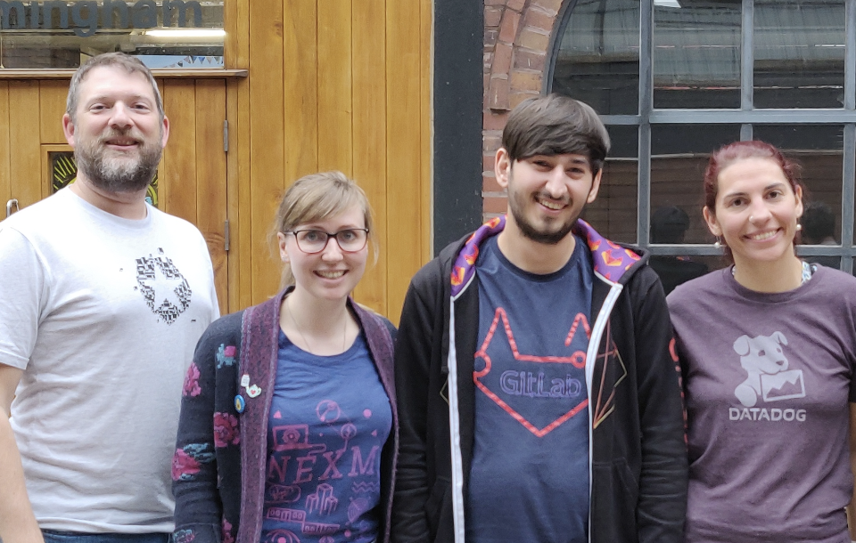

Hackference returns for its 6th year, ran and founded by the amazing [Mike Elsmore](https://twitter.com/ukmadlz). Its purpose is to provide a unique and hands-on learning environment free of any negative influences.

[Jeremy Meiss](https://twitter.com/iamjerdog) gave a great talk on [power and value of identity providers](https://auth0.com/blog/5-reasons-your-company-needs-identity-and-access-management/) at Friday's conference, and we remained on hand for the rest of the weekend to support the Hackathon.

## What You Missed at the Conference

This year, the conference included two tracks: Innovate and Develop. Across these two tracks, speakers included [Doug Sillars](https://twitter.com/dougsillars) on modern image delivery techniques, [Karina Popova](https://twitter.com/kary_key) on geospatial analysis of Twitter content, [Alex Lakatos](https://twitter.com/lakatos88) on natural conversation pieces with bots, and [Jessica Rose](https://twitter.com/jesslynnrose) on a common issue in tech, Burnout. These are to name but a few. [Check out the schedule to see what you missed](https://2018.hackference.co.uk/#schedule).

## Hackathon Winners (of Auth0's prize)

Anna, Carol and Jamie of team "Who Dis?" built an advanced identity service designed to be self-hosted. Based on the IndieAuth login system, their app was created as a custom Auth0 identity provider. When accessing the app, authentication is requested via Auth0's centralised login page where you could select their custom identity provider which could then verify identity.

## Hackathons

Hackathons are an important part of the development world! True innovation and creativity can be expressed in a supportive and collaborative environment, often with the added incentive of some amazing prizes.

Some famous features and products have been born from hackathons. Most notably, the [Facebook “Like” button and Facebook Chat](http://uk.businessinsider.com/facebook-hackathons-2017-6) were both born at company internal hackathons.

In an environment where innovation and creativity are nurtured, amazing things can happen.

These sites will help you find hackathons near you.

-   [Major League Hacking](http://www.mlh.io/)
-   [Hackalist](http://www.hackalist.org/)
-   [Hack Club](https://hackathons.hackclub.com/)
-   [Devpost](http://www.devpost.com/)
-   [Hackathon IO](http://www.hackathon.io/)
-   [HackEvents](http://www.hackevents.co/)
-   [HackathonsNear.Me](http://www.hackathonsnear.me/)

## About Auth0

Auth0, the identity platform for application builders, provides thousands of enterprise customers with a Universal Identity Platform for their web, mobile, IoT, and internal applications. Its extensible platform seamlessly authenticates and secures more than 2.5B logins per month, making it loved by developers and trusted by global enterprises. The company's U.S. headquarters in Bellevue, WA, and additional offices in Buenos Aires, London, Tokyo, Sydney, and Singapore, support its customers that are located in 70+ countries.

For more information, visit [https://auth0.com](https://auth0.com/) or follow [@auth0 on Twitter](https://twitter.com/auth0).