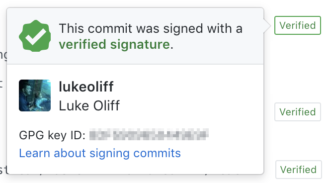
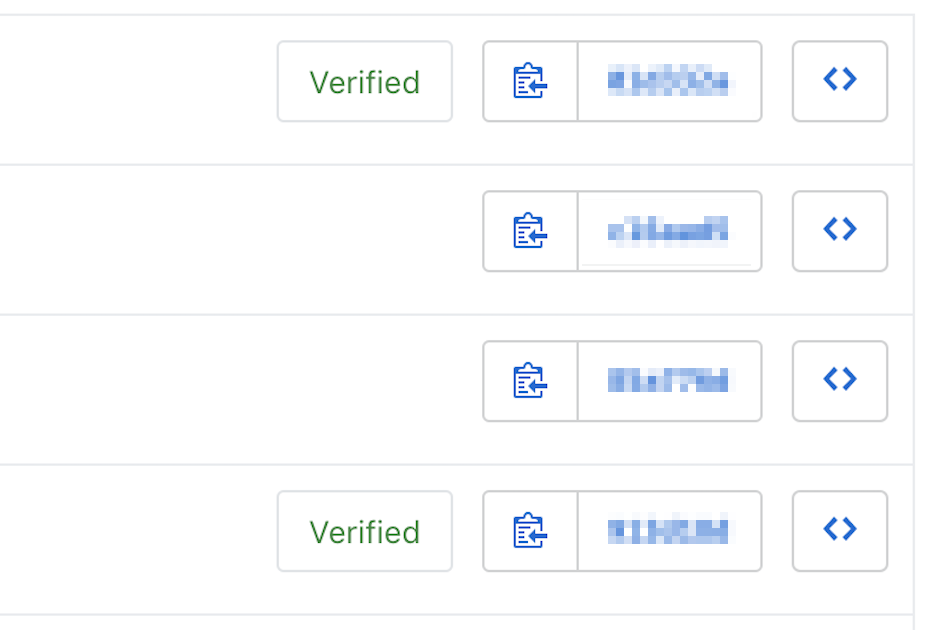

Here's a story about why it is so important to sign both your commits and your tags on your repositories, and to demand the same of your co-contributors.

You’re a maintainer for a well-used package that validates a token against publically accessible keys. As a result, you have access to both the key and the decoded user data. Steve <steve@gmail.com> is a key contributor but only you have permission to merge or tag releases.

Steve helpfully creates a PR for a long-standing and frustrating issue to do with date formatting and daylight savings. All the CI tests passed. There are no conflicts. Great, what’s to worry about? Your cursory glance of the source code about to be merged into your package looks great! It fixes that issue you’ve been procrastinating about for months.

**MERGE.**


Two weeks later, two new related issues pop-up. What now?

Oh.

Somehow, an inconspicuous line has snuck in. It’s serializing the user object and the token and logging it to a strange syslog stream you’ve never seen before. Or have you? Sure, you saw this when you reviewed the code.

You didn’t see this before. You skimmed the code like a turnip and... cue the panic. This is bad.

Git log shows the commits are from your buddy Steve.

```bash
git log
# commit ee89a2d89f235863a8ae71ac27ee68deeb88d55e
# Author: Steve G <steve@gmail.com>
# Date:   Thu Dec 13 09:10:00 2018 +0000
#     Code tidy up
#
# commit 0ab5bc258e769e816bc142b7547a575dfcf69258
# Author: Steve G <steve@gmail.com>
# Date:   Thu Dec 13 09:05:00 2018 +0000
#     Fixes issue 123
#
# commit 64acc8c3be53a0ca6047587535de287cfc0b1fe6
# Author: Steve G <steve@gmail.com>
# Date:   Thu Dec 13 09:00:00 2018 +0000
#     Add some logging
#
# commit a61a1f236e7fe55c99cba212f69be58e71e3cbb7
# Author: Luke Oliff <luke@gmail.com>
# Date:   Thu Dec 11 23:00:00 2018 +0000
#     Recent legit changes
```

Now, you notice that while the commits appear to have come from Steve, the pull-request came from a duplicate GitHub profile that has no history and no repositories.

You see, anyone can spoof a commit.

```bash
git config --global user.email "steve@gmail.com"  
git config --global user.name "Mr Steve"  
git commit -m "Fixes issue 123"
```

You could even try to spoof as me if you liked.

```bash
git config --global user.email "luke@gmail.com"  
git config --global user.name "Luke Oliff"  
git commit -m "Recent legit changes"
```

# How Does Git Help Secure Your Code?

Git uses SHA-1 to hash a snapshot of your repository and stores that into its database. Once a file changes, the hash changes. Hashes are a short 40 character representation of a snapshot of the files as they existed at that time and they’re logged to Git’s database. This means that a file can’t change without Git’s knowledge, maintaining the integrity of the source code.

Git uses system information to assign an identity to commits. Unfortunately, it doesn’t verify identity and too many people use system users (like root or www) to make changes. As I showed you above, you can tell Git you’re… whoever you want to be.

```bash
git config --global user.name "Anakin Skywalker"  
git config --global user.email "vader@deathstar.com"  
git commit -m "Spoiler alert"
```


This means you can keep a log of who is making the changes, but this feature also represents an inherent vulnerability.

Unlike centralized version control (CVS, Subversion, Perforce, etc) which require a server to perform some actions, the majority of Git’s actions are local to the machine performing them.

This distributed version control is one of Git’s standout features, allowing users to diverge and work independently on copies of repositories, converging at a later date. Git calls this cloning and merging.

This feature allows you to distribute responsibility for code changes across teams without needing a server to manage how it all comes back together. To simplify workflows though, lots of teams resort to using a single main repository they all clone from and merge to, where they manage the single-source-of-truth for their code, tag versions and release code from.

Git can’t do everything on its own. A single centralized repository might be private and secure on the network or VPN it’s on, but it comes with an overhead a lot of companies won’t even consider. Git host services like GitHub (or BitBucket, GitLab, among others) provide people with this, on a platform that also provides workflow and management tools to simplify cloning (or forking — a remote clone) and merging.

Besides providing workflow improvement and simplification, remote hosts also allow you to make your remote repositories private, secured as if they were in a secret bubble that only you know of. They will also let you place your code inside an “organisation” where you can add members, requiring them to implement levels of security on their own users before they can interact with the code.

[GitHub organisations](https://help.github.com/articles/differences-between-user-and-organization-accounts/), for example, can enforce Two-Factor Authentication on users that join the organisation. If you’re a business, you might even consider [a business cloud solution, where you can use an identity provider to manage your user access](https://help.github.com/articles/about-authentication-with-saml-single-sign-on/).

# It Isn’t Enough

In the nightmare scenarios above, none of the “security” would prevent a bad actor *that has access to the repository* from spoofing you and committing malicious code. Once they’re in the door, they can do what they want with complete anonymity, clearly seeing the other authors details from the commit log. There are no guarantees that commits are by the person in the git log.

Git allows for the signing of tags, verifying your identity in the process! Great!

Tags are a pointer, a reference, that points to a commit and says “At this point, this commit is version 1.9.2 (arbitrary number) of this code”.

Signing guarantees that the person who created the tag is who you think they are. A commit is built on the history of the commits before it, which means that by signing a tag (and therefore the commit it’s pointing to), it will forever state that the entire history until that point is trusted. Or is it?

Unfortunately, a tag doesn’t verify any future commits. Nor does it necessarily verify the past commits individually. It only states that, to the best of our knowledge, the commit history is trusted by the individual who signed the tag.

# Signing Your Commits

With Git, before version [v1.7.9](http://git.kernel.org/?p=git/git.git;a=blob_plain;f=Documentation/RelNotes/1.7.9.txt;hb=HEAD) at least, you could only sign tags. With this release, commits learned a new trick. Signing commits. This verifies the identity for each commit made to the Git database.

As you can imagine, this adds a great deal of trust to the process. It will ask you to unlock the key using a password every now and then. And, it’s not the experience-killer you might expect, either.

So start signing your commits by creating a GPG key and registering it with your host. Follow the steps below to create a key and register it with GitHub.

## Step 1 — Download the CLI

Download the [GPG command line tool for your operating system](https://www.gnupg.org/download/).

## Step 2 — Generate a Key

Now, on your command line generate a GPG key pair with the following command.

```bash
gpg --full-generate-key
```

## Step 3 — Select the Key Type

When prompted, select a GitHub supported GPG key. `RSA and RSA` is the default, which will work. At the time of writing, GitHub supports; RSA, ElGamal, DSA, ECDH, ECDSA, and EdDSA.

## Step 4 — Enter a Key Size

Enter a key size. GitHub recommends a maximum size of `4096`.

## Step 5 — Enter an Expiry Time

Enter an expiry time. The default doesn’t expire, which I can’t recommend. The shorter the expiry, the less time a compromised key can be used for.

## Step 6 — Verify the Information

Verify your information.

## Step 7 — Enter Your User Information

Enter your user information, making sure you use the same email as your GitHub account.

## Step 8 — Create a Key Password

Create a password to secure your key. [Make it something good](https://www.owasp.org/index.php/Authentication_Cheat_Sheet#Password_Complexity).

## Step 9 — List the Created Keys

List your GPG keys using this command.

```bash
gpg --list-secret-keys --keyid-format LONG
```

## Step 10 — Copy the Key ID

Copy the GPG key ID you'd like to use. In my example, it would be `*0ISTKP05PYH3VW5D*`*.*

```bash
gpg --list-secret-keys --keyid-format LONG  
# /Users/luke/.gnupg/pubring.kbx  
# \------------------------------------  
# sec   rsa4096/0ISTKP05PYH3VW5D 2018-01-28 \[SC\] # 0ISTKP05PYH3VW5D
# uid                 \[ultimate\] Luke Oliff <luke@gmail.com>  
# ssb   rsa4096/YL4430J4NPG5UHLM 2018-01-28 \[E\]
```

## Step 11 — Tell Git About Your Key

Set your global config to use your signing key for all commits you want to sign.

```bash
git config --global user.signingkey *0ISTKP05PYH3VW5D*
```

## Step 12 — Sign All The Things

Once you set this, all commits will initially require your password to confirm your identity before signing. It doesn’t ask you every commit, only after a long period of time between commits.


```bash
git config --global commit.gpgsign true
```

## Step 13— Export the Key

Get your key in a format that GitHub will understand.

```bash
gpg --armor --export *0ISTKP05PYH3VW5D*
```

## Step 14 — Copy the Exported Key

Copy your key, including `-----BEGIN PGP PUBLIC KEY BLOCK-----` and `-----END PGP PUBLIC KEY BLOCK-----` parts.

## Step 15 — Open GitHub Settings

Open your [SSH and GPG keys settings page](https://github.com/settings/keys) on GitHub.

## Step 16 — Start Key Registration

Click New GPG Key.

## Step 17— Paste Key

In the “Key” field, paste the key you copied above

## Step 18 — Confirm Key Registration

Click Add GPG key — you’ll need to reenter your GitHub password as this is a change to your security settings.

Now, when you commit locally you’ll enter your password to confirm that you are… you.

When you look at your commits on GitHub, it will show it knows you were you!



And, among commits of your peers (until they all read this article \*wink wink, share!\*) your GitHub commits will likely look like this.



The more verified users, the fewer holes where an unknown committer could sneak some code in.

# Ten More Best Practices for Code Security

1.  Never use privileged, shared or system accounts (i.e. root, nobody, www, etc.) for editing code or committing changes.
2.  Never assume identity based on a email address.
3.  Do not trust a PGP/GPG key by default — be sure you’ve got a trusted public key from the right person.
4.  Protect your private key WITH YOUR LIFE. Literally.
5.  Keep expiry times short and assign [a strong password](https://www.owasp.org/index.php/Authentication_Cheat_Sheet#Password_Complexity) to protect private keys.
6.  Enforce signing by all committers— otherwise, this process doesn’t protect the code, only those committers who are signing.
7.  Always have a trusted single source-of-truth for your repository.
8.  Configure and review access rights to your projects regularly.
9.  Isolate environments. Test, CI, preproduction and production should not have access to Git. Use `git archive` to deploy code only.
10.  Use `.gitignore` to ignore any filetypes that could be involved in sharing sensitive information. Like database storage files, environment files, config files.

# Conclusion

Spoofing commits is a threat to software integrity. In the year of breaches, it would be prudent to save yourself from [a Git Horror Story](https://mikegerwitz.com/papers/git-horror-story).