[Bootstrap](https://getbootstrap.com/), originally named Twitter Blueprint, was developed by [@mdo](https://github.com/mdo) (Mark Otto) and [@fat](https://github.com/fat) (Jacob Thornton) while working at Twitter as a way to encourage consistency across tooling. Now, it is one of the most popular front-end frameworks and open source projects in the world. While still considered a shortcut by many front-end developers, it has played an important role in bringing a consistent and friendly user experience into the clutches of all developers, globally.

The design web is awash with all sorts of examples of messaging UIs, but developers lack choice on frameworks that give them messaging UIs that are quick and easy to implement, that lean on something as straightforward as  [Bootstrap](https://getbootstrap.com/), and that don't use a lot of custom CSS or JavaScript. You *can* find messaging UIs for [Bootstrap](https://getbootstrap.com/) in the wild, but none of them seem to ease you in by using simple standard components from the [Bootstrap](https://getbootstrap.com/) library.

In this guide, you're going to enhance an existing chat application with [Bootstrap 4](https://getbootstrap.com/), using standard components and minimal CSS editing.

The [demo application](https://github.com/nexmo-community/bootstrap-styled-nexmo-chat) and a [finished example](https://github.com/nexmo-community/bootstrap-styled-nexmo-chat/tree/tutorial-end) can be found on GitHub now.

## Prerequisites

### Node & NPM

To get started, you're going to need Node and NPM installed. This guide uses Node 8 and NPM 6. Check they're installed and up-to-date.

```bash
node --version
npm --version
```

> Both Node and NPM need to be installed and at the correct version. Go to nodejs.org and install the correct version if you don't have it.

### Nexmo CLI

To set up your application, you'll need to install the Nexmo CLI. Install it using NPM in the terminal.

```bash
npm install -g nexmo-cli@beta
```

[Sign up for a free Nexmo account](https://dashboard.nexmo.com/sign-up) and set up the Nexmo CLI with the API key and secret found on the dashboard.

```bash
nexmo setup <your_api_key> <your_api_secret>
```

### Git (Optional)

You can use git to clone the [demo application](https://github.com/nexmo-community/bootstrap-styled-nexmo-chat) from GitHub.

> For those uncomfortable with git commands, don't worry, I've you covered. This guide contains instructions on downloading the project as a ZIP file.

Follow this [guide to install git](https://git-scm.com/book/en/v2/Getting-Started-Installing-Git).

## The Demo Application

The demo application is simply a basic implementation of [Nexmo's Conversation Client SDK](https://www.npmjs.com/package/nexmo-client) chat, which is a JavaScript library for implementing WebRTC quickly and easily. 

### Basic Installation

To keep this guide easy to follow, clone the demo application straight from GitHub.

```bash
git clone https://github.com/nexmo-community/bootstrap-styled-nexmo-chat.git
```

For those not comfortable with git commands, you can [download the demo application as a zip file](https://github.com/nexmo-community/bootstrap-styled-nexmo-chat/archive/master.zip) and unpack it locally.

Once cloned or unpacked, change into the new demo application directory.

```bash
cd bootstrap-styled-nexmo-chat
```

Install the npm dependencies.

```bash
npm install
```

Configure the application port using an environment file. Copy the example file:

```bash
cp .env.example .env
```

Now, edit the environment file `.env` and set the port to 3000 (or whichever port you require).

```env
# app config
PORT=3000
```

Among other packages installed by your last command, there is a package called `nodemon`, that allows you to reload your application if you edit any files automatically.

To start the application in the standard way, run: 

```bash
npm start
```

To start the application, but with nodemon instead, run:

```bash
npm run dev
```

> ***Tip:*** If you're running the application with `nodemon` for the remainder of this tutorial, whenever I suggest restarting the application, you won't need to do that because `nodemon` does it for you. However, if you need to reauthenticate with the application, you will still need to do that, as the session information is stored in memory and not configured to use any other storage.

Whichever way you choose to run the application, once it's running, you can try it out in your favourite browser, which should be able to find it running locally: [http://localhost:3000](http://localhost:3000).

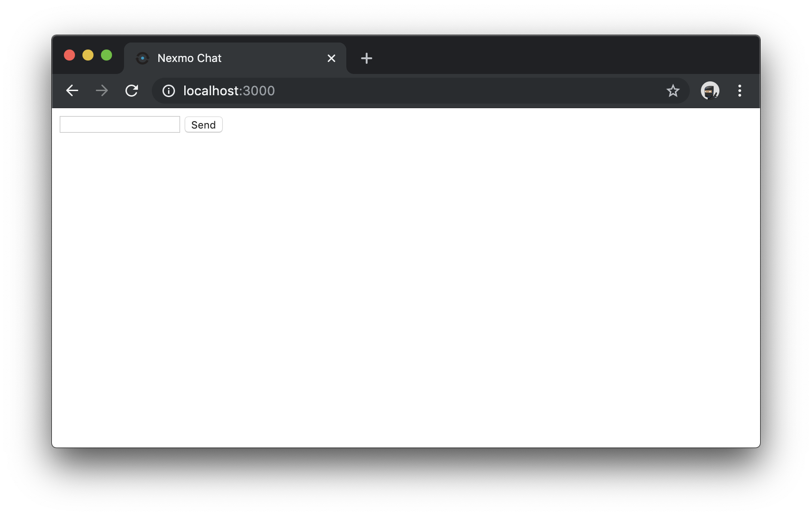

It's mostly blank, you can't message anyone, and if you look in your browser console, you'll find Nexmo API errors, because it's time to configure the application. 

## Configure the Demo Application

To connect to Nexmo, and send or receive messages from the service, you need to configure the demo application.

#### Create a Nexmo Application

Firstly, create a Nexmo Application with RTC (real-time communication) capabilities. The event URL will be a live log of events happening on the Nexmo service, like users joining/leaving, sending messages, enabling audio (if you felt like enabling it).

```bash
nexmo app:create "Nexmo RTC Chat" --capabilities=rtc --rtc-event-url=http://example.com --keyfile=private.key
# Application created: 4556dbae-bf...f6e33350d8
# Credentials written to .nexmo-app
# Private Key saved to: private.key
```

#### Create a Nexmo Conversation

Secondly, create a Nexmo Conversation, which acts like a chatroom. Or, a container for messages and events.

```bash
nexmo conversation:create display_name="Bootstrap Chat"
# Conversation created: CON-a57b0...11e57f56d
```

#### Create Your User

Now, create a user for yourself. 

> ***Note:*** In this demo, you won't chat between two users. [Other guides]() [show you]() how to [create conversations]() between [multiple users](). This guide focusses on styling your message UI in a simple, yet appealing, way.

```bash
nexmo user:create name=<USER_NAME> display_name=<DISPLAY_NAME>
# User created: USR-6eaa4...e36b8a47f
```

#### Add the User to a Conversation

Next, add your new user to the conversation. A user can be a member of an application, but they still need to join the conversation.

```bash
nexmo member:add <CONVERSATION_ID> action=join channel='{"type":"app"}' user_id=<USER_ID>
# Member added: MEM-df772...1ad7fa06
```

#### Generate a User Token

Lastly, generate your new user a token. This token represents the user when accessing the application. This access token identifies them, so anyone using it will be assumed to be the correct user.

In practice, you'll configure the application with this token. In production, these should be guarded, kept secret and very carefully exposed to the client application, if at all.

```bash
nexmo jwt:generate ./private.key sub=<USER_NAME> exp=$(($(date +%s)+86400)) acl='{"paths":{"/*/users/**":{},"/*/conversations/**":{},"/*/sessions/**":{},"/*/devices/**":{},"/*/image/**":{},"/*/media/**":{},"/*/applications/**":{},"/*/push/**":{},"/*/knocking/**":{}}}' application_id=<APPLICATION_ID>
# eyJhbGciOi...XVCJ9.eyJpYXQiOjE1NzM5M...In0.qn7J6...efWBpemaCDC7HtqA
```

#### Configure the Application

Having generated all the parts you'll need, edit the `views/layout.hbs` file and find the JavaScript shown here.

```html
    <script>
      var userName = '';
      var displayName = '';
      var conversationId = '';
      var clientToken = '';
    </script>
```

Edit the config with the values you've generated in the commands above.

```html
    <script>
      var userName = 'luke'; // <USER_NAME>
      var displayName = 'Luke Oliff'; // <DISPLAY_NAME>
      var conversationId = 'CON-123...y6346'; // <CONVERSATION_ID>
      var clientToken = 'eyJhbG9.eyJzdWIiO.Sfl5c'; // this will be much much longer
    </script>
```

Now configured, restart the application. Access it using the [same application URL](http://localhost:3000). 

The first thing you'll notice is a line saying you've joined the conversation with your user.

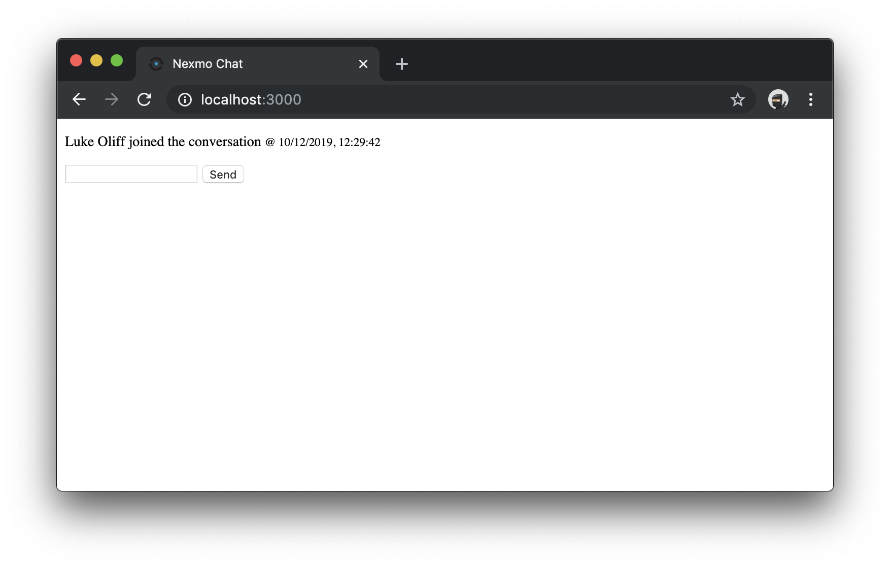

Then, you can send some messages using the form, where you'll be able to message yourself to your heart's content.

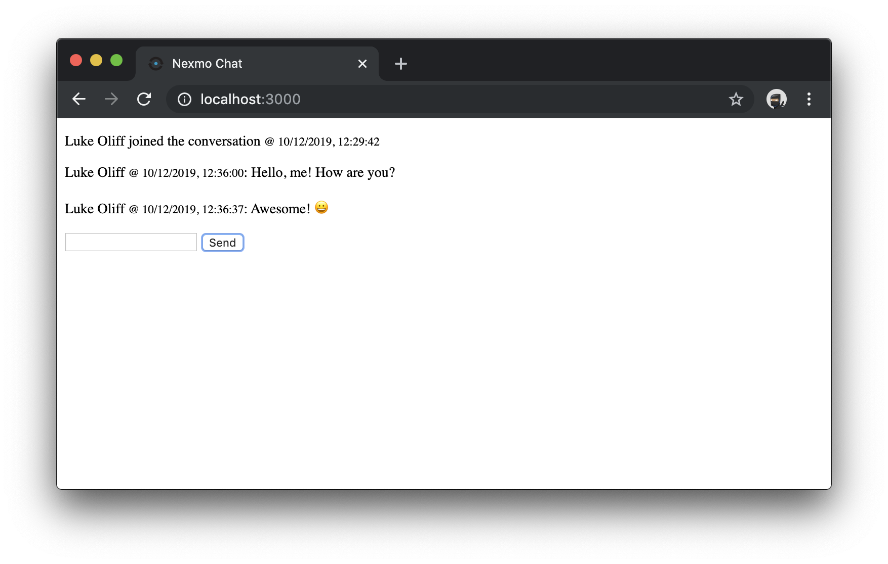

## Simple Messaging UI with Bootstrap

With your basic application up and running, now you can style it using Bootstrap. 

Each step of this guide is individually committed to the [finished example branch](https://github.com/nexmo-community/bootstrap-styled-nexmo-chat/tree/tutorial-end) of this project. So, if at any time you encounter an error in the process, you can [refer to the commits themselves](https://github.com/nexmo-community/bootstrap-styled-nexmo-chat/pull/1/commits). You'll also find links to the relevant commit at each stage. 

### The HTML

#### Adding Bootstrap to the Application

You'll start by editing the `views/layout.hbs` file still and modifying the main design of the application to include the Bootstrap CSS and JavaScript resources. 

Following the [Bootstrap Getting Started](https://getbootstrap.com/docs/4.4/getting-started/introduction/) guide, add this `<link>` tag inside your `<head>` before all the other stylesheets, to load the CSS resources. The `<link>` tag below is an example, you can either refer to [the commit](https://github.com/nexmo-community/bootstrap-styled-nexmo-chat/pull/1/commits/502ce05cc9e4869596e28a71119558f0aff7e4f8) in the demo application, or use the `<link>` tag in the Bootstrap Getting Started guide.

```html
<!-- views/layout.hbs -->
<!DOCTYPE html>
<html>
  <head>
    <!-- //... -->
    <link rel="stylesheet" href="https://stackpath.bootstrapcdn.com/..." integrity="..." crossorigin="anonymous">
    <!-- //... -->
  </head>

  <!-- //... -->
```

Additionally, you'll need the recommended Bootstrap and JavaScript libraries. These, arguably, are not required here. But, many of the Bootstrap components require the use of JavaScript to function properly, also relying on Popper.js and jQuery. Again, you can either refer to [the commit](https://github.com/nexmo-community/bootstrap-styled-nexmo-chat/pull/1/commits/502ce05cc9e4869596e28a71119558f0aff7e4f8) in the demo application or use the `<script>` tags in the Bootstrap Getting Started guide.

```html
<!-- views/layout.hbs -->

<!-- //... -->

  <!-- //... -->
  
    <!-- //... -->
    <script src="https://code.jquery.com/..." integrity="..." crossorigin="anonymous"></script>
    <script src="https://cdnjs.cloudflare.com/ajax/libs/popper.js..." integrity="..." crossorigin="anonymous"></script>
    <script src="https://stackpath.bootstrapcdn.com/..." integrity="..." crossorigin="anonymous"></script>
  </body>
</html>
```

Restart the application and [take a look again](http://localhost:3000). You can see that these changes have had minimal effect.

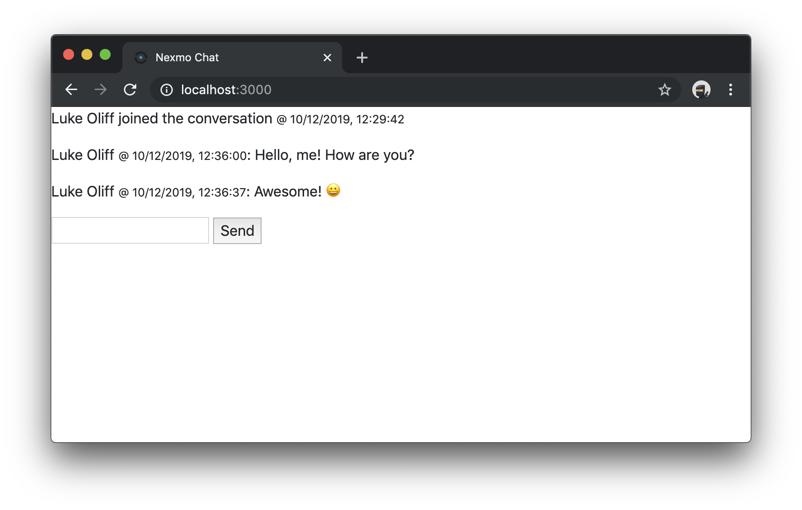

#### Adding Nav and Container Components

With Bootstrap now included within your application, you can add your `<nav>` and container to the main layout.

Still editing `views/layout.hbs`, add the following code to wrap the existing `{{{body}}}` expression.


```hbs
<!-- views/layout.hbs -->

<!-- //... -->

  <!-- //... -->
    <nav class="navbar navbar-dark fixed-top bg-dark flex-md-nowrap p-0 shadow">
      <a class="navbar-brand col-sm-3 col-md-2 mr-0" href="#">{{title}}</a>
    </nav>

    <div class="container-fluid">
      <div class="row">

        <main role="main" class="col-md-12">
          <div class="d-flex justify-content-between flex-wrap flex-md-nowrap align-items-center pt-3 pb-2 mb-3 border-bottom">
            <h1 class="h2">Bootstrap Chat</h1>
          </div>

          {{{body}}}

        </main>
      </div>
    </div>
  <!-- //... -->

<!-- //... -->
```


If you'd like to see the exact changes to the file, you can take a look at [the commit](https://github.com/nexmo-community/bootstrap-styled-nexmo-chat/pull/1/commits/d7bb8ee090afae4f0008c582a2c70b0af7b31b92).

You'll now see you've added a navbar, but the chat remains in unstyled, which causes some display issues. Restart the application to [see what it looks like now](http://localhost:3000).

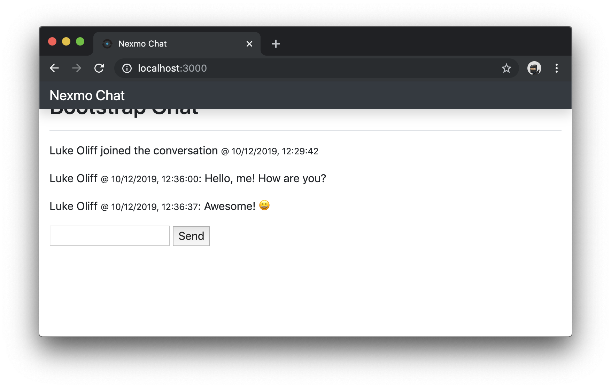

#### Lists and Inputs

Because messaging UIs are a list of messages, you'll use a list element `<ul>` semantically.

Edit `views/index.hbs` and change the `<div id="messageFeed">` to a unordered (bulleted) list element `<ul>` as shown. The `list-unstyled` class is a Bootstrap class that removes bullets and indentation from native list styling.

```hbs
        <ul class="list-unstyled" id="messageFeed">
        </ul>
```

Using the appropriate semantic markup for lists has the benefit of showing the information correctly in text browsers and screen readers. Your messages will eventually be list item `<li>` elements, too.

While editing `views/index.hbs`, you may as well make the following replacements. Find these two `<input>` elements. 

```hbs
          <input type="text" id="messageTextarea">
          <input type="button" id="send" value="Send" />
```

Replace them with this markup, which contains a Bootstrap button group, a styled text area, and a send button.

```hbs
          <div class="input-group mb-3">
            <input type="text" class="form-control" id="messageTextarea">
            <div class="input-group-append">
              <button class="btn btn-outline-secondary" type="button" id="send">Send</button>
            </div>
          </div>
```

Take a look at [the commit](https://github.com/nexmo-community/bootstrap-styled-nexmo-chat/pull/1/commits/4b18a0191b867ba1fd81dbd4ac10455a9a61ecf1) to see exactly how the file should be edited.

Restart the application and [take a look again](http://localhost:3000). While you've changed how the messages get added, it hasn't changed much about the styling. But, at least the form is closer to what you'd expect from a messaging UI.


### The CSS

With your markup changes finished, some strange things are going on in the layout.

These three CSS changes are available to view in a [single commit](https://github.com/nexmo-community/bootstrap-styled-nexmo-chat/pull/1/commits/6745ea353af6da5d2c025e4169ef88ca0fbddb6c) to `public/stylesheets/style.css`.

#### Fixed Navbar Margins

The first CSS change is to add `padding-top` to the main content container, allowing for the height of the navbar (40px) and suitable whitespace based on the default styling of Bootstrap (8px).

```css
/* ... */

[role="main"] {
  padding-top: 48px; /* space for fixed navbar (40px) and margin (8px) */
}
```

Restart the application and [try it](http://localhost:3000).

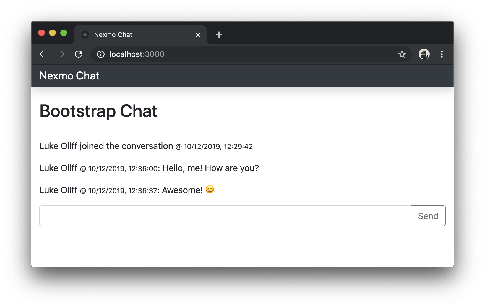

#### Scrollable Message Feed

This change to `messageFeed` fixes the height of the element that contains out messages, to be 100% of the viewport height minus the heights of the navbar (48px), main title bar (71px) and the footer (yet to be styled, at 53px).

```css
/* ... */

#messageFeed {
  height: calc(100vh - 172px); /* space for fixed navbar (48px), "main" title (71px), footer (53px) */
  overflow-y: scroll; /* vertical scroll for the message feed */
}
```

Restart the application and [try it](http://localhost:3000). To see the overflow scrolling for the `messageFeed`, you'll need to send some more messages.

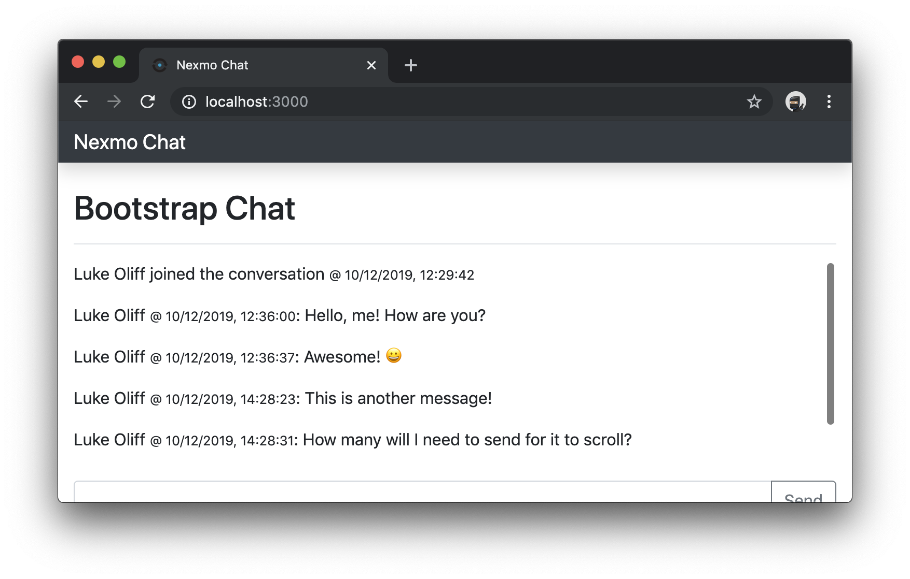

#### Fixed Text Entry for Sending Messages

This last CSS change is for the `<footer>`, which contains the text entry and button. You'll want to fix them to the bottom of the window, full width. Set the height (53px), give it a background colour, and add a standard edge margin defined by the Bootstrap theme.

```css
/* ... */

#messages footer {
  position: fixed;
  bottom: 0;
  left: 0;
  width: 100%; /* 100% of page width */
  padding: 0 15px 15px 15px; /* standard edge margin (15px) */
  height: 53px; /* space for input height (38px) + bottom padding (15px) */
  background-color: #fff;
}
```

Restart the application and [try it](http://localhost:3000).


### The JavaScript

The last changes you'll make to the demo application is to the JavaScript that came with the demo. These changes are all made to the `public/javascripts/chat.js` file. 

#### Markup for the Member Joined Event

Edit the file and find the `memberJoined` function. Change it to return a list item `<li>` element as shown below.

```js
// public/javascripts/chat.js

//...

  memberJoined(member, event) {
    const date = new Date(Date.parse(event.timestamp));

    return `<li class="my-2 text-center">` +
    `<p>${member.display_name} joined the conversation <small>@ ${date.toLocaleString('en-GB')}</small></p>` +
    `</li>`;
  }

//...
```

To see how the JavaScript function is modified, take a look at [the commit](https://github.com/nexmo-community/bootstrap-styled-nexmo-chat/pull/1/commits/b431e75ca6f000e8b8bcb0622928262d604ae87c).

Restart the application and try it again using the [application URL](http://localhost:3000). You'll now see that the user joined message is centred nicely in the message feed.

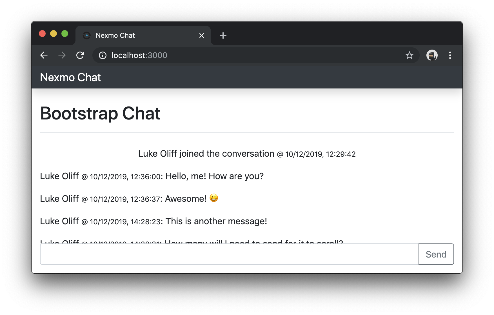

#### Markup for From-Me and To-Me Messages

In the same file, find the `senderMessage` function. Edit it to return a list item `<li>` element that is a [Media object](https://getbootstrap.com/docs/4.4/components/media-object/). Media objects are similar to messages in that they have a title (for the author and metadata), contents (the message), and an optional image.

In this instance, you have a condition that determines the output:
 - A standard Media object if the current `user.name` equals the message `user.name` - **From-Me**.
 - A Media object with text aligned to the right, if the current `user.name` doesn't equal the message `user.name` - **To-Me**.

```js
// public/javascripts/chat.js

//...

  senderMessage(user, sender, message) {
    const date = new Date(Date.parse(message.timestamp))
    var output = '';

    if (user.name === sender.user.name) {
      output = `<li class="media my-3">` +
      `<div class="media-body">` +
      `<h5 class="mt-0 mb-1">${sender.display_name} <small>@ ${date.toLocaleString('en-GB')}</small></h5>` +
      message.body.text +
      `</div>` +
      `</li>`;
    } else {
      output = `<li class="media my-3">` +
      `<div class="media-body text-right">` +
      `<h5 class="mt-0 mb-1">${sender.display_name} <small>@ ${date.toLocaleString('en-GB')}</small></h5>` +
      message.body.text +
      `</div>` +
      `</li>`;
    }

    return output;
  }

//...
```

To see how this JavaScript function is modified, take a look at [the commit](https://github.com/nexmo-community/bootstrap-styled-nexmo-chat/pull/1/commits/c5dc597f1a8f087f921be9212a7d329a1f3a952c).

Restart the application and try it again using the default URL: [http://localhost:3000](http://localhost:3000). You'll now see that your messages styled nicely.

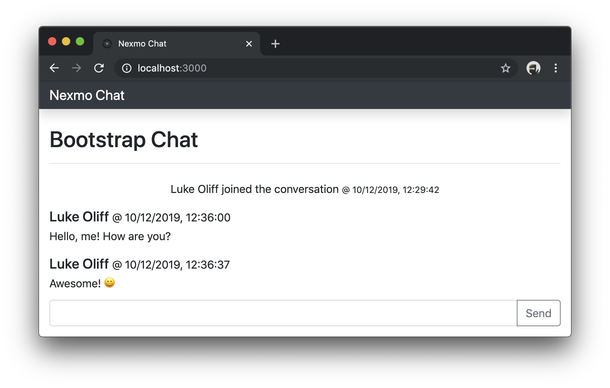

#### Add Adorable.io Avatars for Users

With no user profiles in your application, the lack of avatars leaves it looking a bit empty. So, to complete the Media object look and to give it the effect of a modern-day chat application, you can use a placeholder avatar service like [adorable.io](https://adorable.io/) based on user information.

Adorable will take any string as part of a URL, [https://api.adorable.io/avatars/64/my-string-here.png](https://api.adorable.io/avatars/64/my-string-here.png) and return a funny face. It's a great way to add a placeholder image that changes between users.

So, still editing the same file, go back to the `senderMessage` function, and add this line after the opening line item `<li>` element, for messages **from-me**.

```js
// public/javascripts/chat.js

//...

      `` +

//...
```

Then, add this line in the **to-me** side of the condition, just before the closing line item `</li>` element.

```js
// public/javascripts/chat.js

//...

      `` +

//...
```

The critical difference between these lines is that one has the `mr-3` class, and one has the `ml-3` class. One is for a left-aligned image with a margin on the right. The other a right-aligned image with a margin on the left. Getting those muddled might make it look a bit odd. So take a look at [this commit](https://github.com/nexmo-community/bootstrap-styled-nexmo-chat/pull/1/commits/749819da754c9bcc4a8f4f31c0887c070290be9b) to double-check you've got it the right way around.

Once you're happy with your changes, restart and [take a look at the application](http://localhost:3000). 

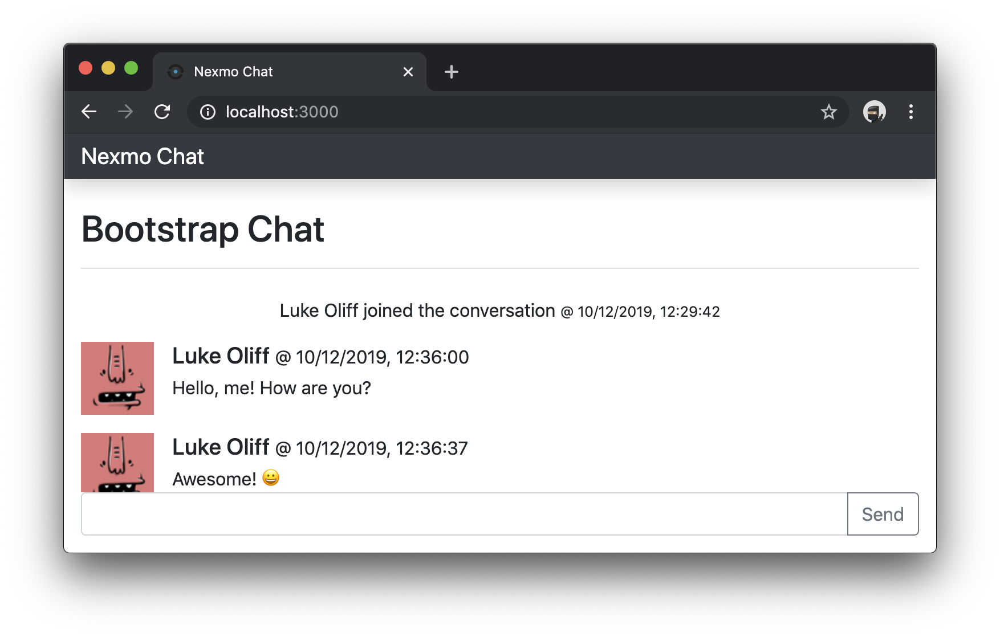

#### Add Scroll-To-Bottom for Messages

Conventional messaging UIs have the newest messages at the bottom, and you scroll up to see older ones. The demo application orders messages and events like this too. So, to stay focused on the correct content, you can now add the following code. This code will scroll the message feed to the bottom automatically when a new message comes in, only if the message feed was already at the bottom. That way, say you scroll up to see older messages, it won't do anything.

Add two new functions to the `chat.js` file. The first function will return boolean, whether `messageFeed` is at to the bottom or not. The other will scroll `messageFeed` to the bottom.

```js
// public/javascripts/chat.js

//...

  isFeedAtBottom() {
    return (this.messageFeed.offsetHeight+this.messageFeed.scrollTop)===this.messageFeed.scrollHeight;
  }

  scrollFeedToBottom() {
    this.messageFeed.scrollTop = this.messageFeed.scrollHeight;
  }
  
//...
```

Next, modify the event listeners for new messages sent, and new members added to the conversation. In both cases, you'll record the scroll position of the message feed before adding the line item. Then, you'll scroll (or not) based on the context prior to the change.

```js
// public/javascripts/chat.js

//...

  setupConversationEvents(conversation, user) {
    //...

    conversation.on('text', (sender, message) => {
      var feedAtBottom = this.isFeedAtBottom();

      // ...

      if (feedAtBottom) {
        this.scrollFeedToBottom();
      }
    })

    conversation.on("member:joined", (member, event) => {
      var feedAtBottom = this.isFeedAtBottom();

      // ...

      if (feedAtBottom) {
        this.scrollFeedToBottom();
      }
    })
  
    //...

  }
  
//...
```

The last change to the demo app is to scroll the message feed to the bottom when the page loads. So, after the line where you add the `eventsHistory` to the message feed (`this.messageFeed.innerHTML = eventsHistory + this.messageFeed.innerHTML`), add `this.scrollFeedToBottom();`.

```js
// public/javascripts/chat.js

//...

  showConversationHistory(conversation, user) {
    // ...

      // ...

        this.messageFeed.innerHTML = eventsHistory + this.messageFeed.innerHTML;

        this.scrollFeedToBottom();

      // ...

    // ...
  }

//...
```

To make sure you applied this change correctly, you can [view the commit](https://github.com/nexmo-community/bootstrap-styled-nexmo-chat/pull/1/files#diff-c7813fc17e7631420a4b041dff0ba0b2).

Once you're happy with your changes, restart and [take a look at the application](http://localhost:3000).

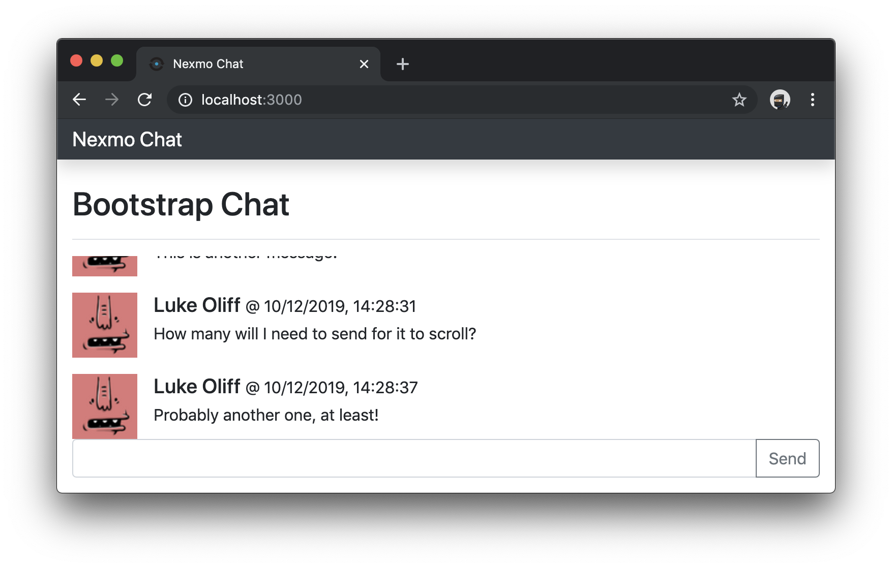

## The End

If *I* was building a chat application, this is how *I'd* want it to look. 

Hopefully, this guide to building a messaging UI comes in handy for you. It includes the basics, like **From-me** and **To-me** alignment, auto-scrolling to the bottom, and user avatar placeholders.

You could now apply these UI techniques in some other Nexmo Conversation Client SDK tutorials like [Enabling Audio in an Existing Chat Application], [Register to Chat with Typeform], and the JavaScript Client SDK Getting Started guides. 

Some of our other guides include sending messages between multiple users! I challenge you to get multiple users messaging each other using a neat looking messaging UI and share your progress.

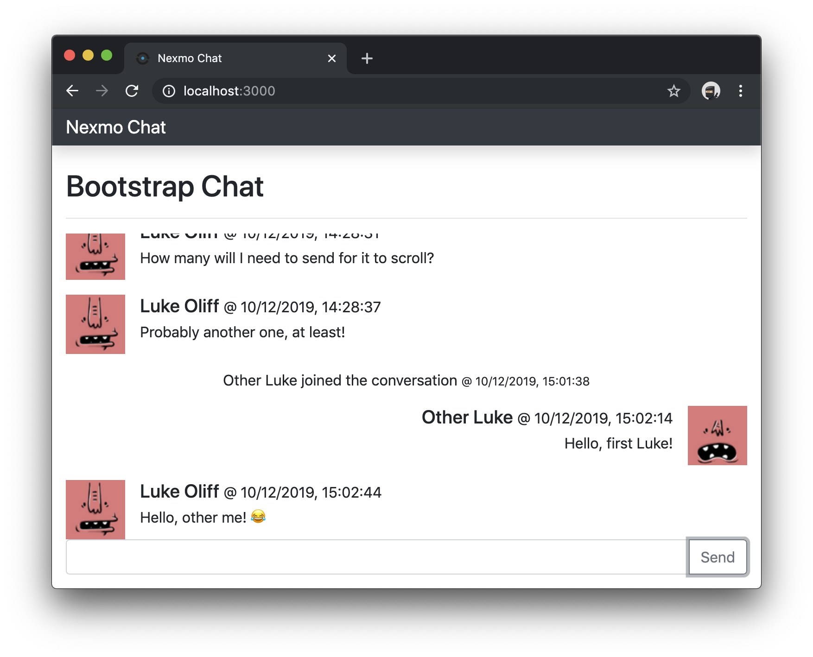

And don't forget, if you have any questions, advice or ideas you'd like to share with the broader community, then please feel free to jump on our [Community Slack](https://developer.nexmo.com/community/slack) workspace or pop a reply below 👇.